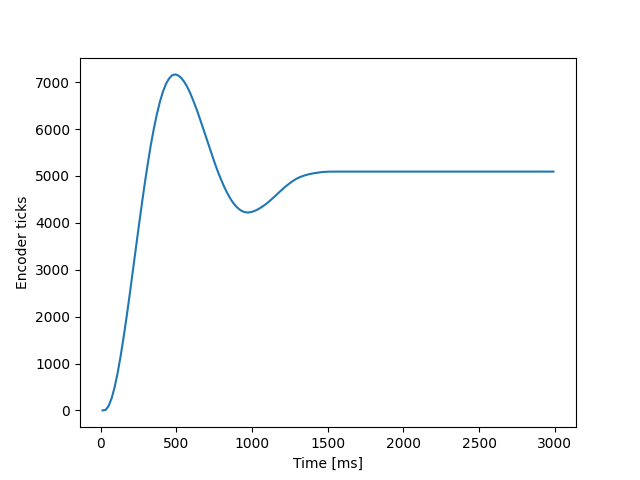
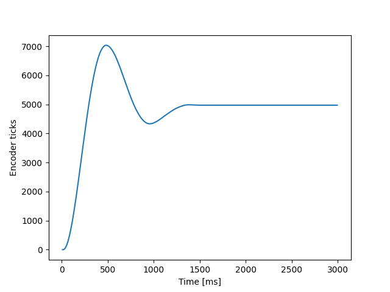
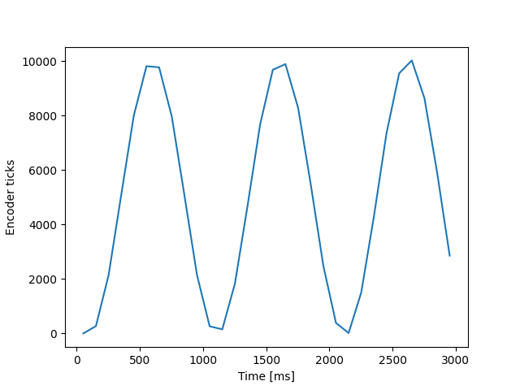

# 405L3 - Task scheduling
## Description
 
This repository contains code that allows for task scheduling (the ability to do different tasks "concurrently"). It also includes code to test how the scheduling interval of tasks affects the performance of a proportionally controlled motor.

## Usage

1. Modify the test parameters as desired in main.py. The relevant lines of code and their numbers are shown below.

Gain/setpoint of motors:
```
40: C1 = closedloopcontrol.cl_loop(0.015, 5000)
46: C2 = closedloopcontrol.cl_loop(0.015, 10000)
```

Task scheduling period:
```
50: task1 = cotask.Task(task_mc, name='Motor_1', priority=1, period=10,
52: task2 = cotask.Task(task_mc, name='Motor_2', priority=2, period=10,
```

2. Run double_test.py on the PC. Note that double_test is only configured to plot motor 1 position data by default. In order to enable plotting of motor 2's position, uncomment the following line on line 30 in double_test.py:

```
40: #pyplot.plot(t2, p2)
```

3. Run main.py on the MicroPython board.

## Test results

Tests were performed using a setpoint of 5000 ticks and a gain value of 0.015.



The above plot was taken using the reference scheduling period of 10 ms. The motor performed as expected.



The above plot was taken using the scheduling period of 7.5 ms. Performance is marginally better than at 10ms. Attempts at scheduling the proportional controller faster than this period resulted in a memory allocation error. However, it is likely that this is due to the proportional controller collecting data points every time the run() method is performed. If it did not need to collect (and store) the position data, it could probably be run faster without encountering this issue.



The above plot was taken using the scheduling period of 50 ms. Performance is degraded to the point that the motor never settles even though the test parameters have not changed from the previous two runs. This is because at a 50ms interval, the controller's run() method isn't called fast enough and the motor overshoots the setpoint before a new PWM value can be generated.

In general, a period of 10 to 20 milliseconds should be appropriate in order to preserve functionality of the motor controller.
